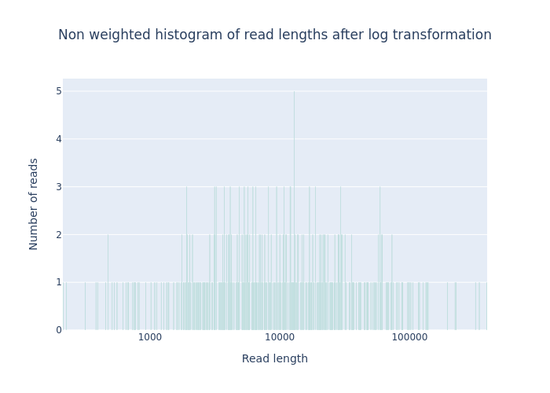
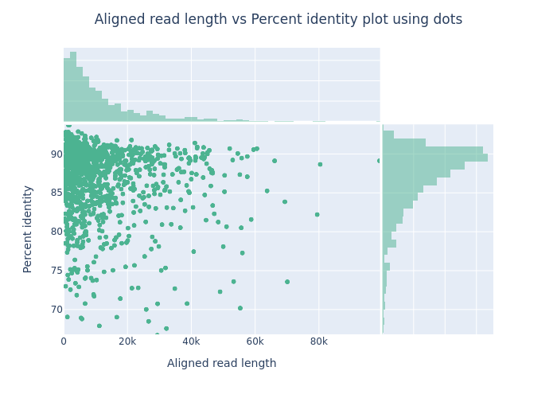

Nanopack is a tool set of different long read processing and analysis tools. Below you'll find elaborate exercises explaining all the different faeatures of this toolset.  
The publischer also provided a *test-data* set which can be downloaded in preparation of this tutorial.

**Tool**: [https://github.com/wdecoster/nanopack](https://github.com/wdecoster/nanopack)  
**Download test data**: [https://github.com/wdecoster/nanotest](https://github.com/wdecoster/nanotest)  
**Publication**: [NanoPack: visualizing and processing long-read sequencing data](https://doi.org/10.1093/bioinformatics/bty149) 
>Wouter De Coster, Svenn D’Hert, Darrin T Schultz, Marc Cruts, Christine Van Broeckhoven, NanoPack: visualizing and processing long-read sequencing dta, Bioinformatics, Volume 34, Issue 15, August 2018, Pages 2666–2669, https://doi.org/10.1093/bioinformatics/bty149  

## Preparations   
### Installation    
Please follow the installation instructions on the [nanopack github website](https://github.com/wdecoster/nanopack?tab=readme-ov-file) for installing all the individual tools and modules.  
If you are using [conda](https://docs.anaconda.com/) on your local machine for installing scientific software you can use a dedicated `nanopack.yml` file and follow the instructions below.  
!!! NOTES
	For more information on how to install miniconda on your system have a look here: https://docs.anaconda.com/miniconda/ 


Following these instructions should create a dedicated environment and install all necessary dependencies:  

1. **Download** environment file
	```bash
	wget https://raw.githubusercontent.com/passelma42/conda-envs-VM/main/nanopack.yml
	```  
2. **Create the environment and install all dependencies**  
	```bash
	conda env create -f nanopack.yml
	```  
3. **Activate the env**  
	```bash
	conda activate Nanopack
	```  
4. **Verify installation**  
	```bash
	conda list
	```  
### Download test data  
Clone the git repo.  
```bash title="Example"
git clone git@github.com:wdecoster/nanotest.git
```

- `NanoStat`: [https://github.com/wdecoster/nanotest](https://github.com/wdecoster/nanotest)
- `Cramino`: [https://github.com/wdecoster/cramino/tree/master/test-data](https://github.com/wdecoster/cramino/tree/master/test-data)  
- `Chopper`: [https://github.com/wdecoster/chopper/tree/master/test-data](https://github.com/wdecoster/chopper/tree/master/test-data) 


## NanoStat  
**Tool for basic statistics.**  

**Exercise 1**  
Generating Basic Statistics from a FASTQ File.  
You are provided with a compressed FASTQ file (`reads.fastq.gz`). Generate a statistics report and save the output in a folder called `statreports` and filnema `nanostats.out`.

**Command**:
```bash
NanoStat --fastq reads.fastq.gz --outdir statreports -n nanostats.out
```

**Objective**:
- Learn how to calculate and store basic statistics from a FASTQ file.
- Explore the statistical metrics NanoStat provides for sequencing data.

---
**Exercise 2: Working with Summary Files**
You are given a sequencing summary files (`sequencing_summary.txt`). Generate a report from this summary files.

**Command**:
```bash
NanoStat --summary sequencing_summary.txt --outdir statreports -n nanostats-seqsummary.out
```

**Objective**:
- Learn how to calculate statistics from multiple summary files and filter based on specific read types (1D2 in this case).
- Understand how NanoStat handles multiple input files and the read type filtering option.

---

**Exercise 3: Calculating Statistics for BAM Files**
You are working with multiple BAM files (`alignment.bam`). Generate statistics for aligned reads and print the results to the terminal.

**Command**:
```bash
NanoStat --bam alignment.bam
```

**Objective**:
- Explore how NanoStat calculates statistics from BAM files containing aligned reads.
- Understand the metrics provided for aligned data and how to handle BAM files.

---

**Exercise 4: Exporting Statistics as TSV**
You are provided with a FASTA file (`reads.fasta.gz`). Generate a statistics report and export it as a TSV (Tab-Separated Values) file.

**Command**:
```bash
NanoStat --fasta reads.fasta.gz --tsv --outdir tsv_report -n nanostat-tsv.out
```

**Objective**:
- Learn how to generate and export statistics in TSV format, which can be useful for downstream analysis.
- Explore how to work with FASTA files as input data.

---  

## Chopper   
**A rust implementation combining NanoLyse and NanoFilt into one faster tool for filtering, trimming, and removing contaminants.**  

**Download test data:**  
[https://github.com/wdecoster/chopper/tree/master/test-data](https://github.com/wdecoster/chopper/tree/master/test-data)

**Exercise 1: Basic Quality Filtering**  
You are provided with a FASTQ file (`reads.fastq`) and need to filter out reads with a Phred average quality score below 20. Use the default settings for other parameters.

**Command**:
```bash
chopper -q 20 -i ./nanotest/reads.fastq.gz > Q20_filtered.reads.fastq
```

**Objective**:
- Learn how to filter reads based on minimum quality score.
- Understand the impact of quality filtering on read data.
- Get statistics from your reads before and after filtering and compare.

---

**Exercise 2: Length-Based Filtering**  
You have a FASTQ file (`reads.fastq`) and need to filter out reads shorter than 100 base pairs and longer than 1000 base pairs. Use the default settings for other parameters.

**Command**:
```bash
chopper -l 10000 --maxlength 250000 -i reads.fastq > length_filtered_reads.fastq
```

**Objective**:
- Learn how to filter reads based on length.
- Understand how length-based filtering affects the dataset.

---

**Exercise 3: Quality and Length Filtering with Trimming**  
You are working with a FASTQ file (`reads.fastq`). Set a minimum quality score of 30 and filter reads between 200 and 800 base pairs in length. Trim 10 nucleotides from both the start and end of each read.

**Command**:
```bash
chopper -q 12 -l 200 --maxlength 250000 --headcrop 10 --tailcrop 10 -i reads.fastq.gz > filtered_trimmed_reads.fastq
```

**Objective**:
- Learn how to combine quality and length filtering with trimming.
- Explore the effects of trimming on read length and quality.

---

**Exercise 4: Contaminant Filtering**  
You have a FASTQ file (`test.fastq`) and a contaminant FASTA file (`random_contam.fa`). Filter out reads that match contaminants using **Chopper**.

**Command**:
```bash
chopper -c chopper-random_contam.fa -i chopper.test.fastq > chopper_clean_reads.fastq
```

**Objective**:
- Learn how to filter reads based on contamination against a FASTA file.
- Understand the process of removing contaminant sequences.

---

**Exercise 5: Inverse Filtering**  
You are provided with a FASTQ file (`reads.fastq`) and need to keep only the reads that do not match the contaminants in `contaminants.fasta`.

**Command**:
```bash
chopper -c chopper-random_contam.fa --inverse -i chopper.test.fastq > chopper_clean_reads_inverse.fastq
```

**Objective**:
- Learn how to use inverse filtering to retain non-contaminant reads.
- Understand the difference between standard and inverse filtering.

---

**Exercise 6: GC Content Filtering**  
You have a FASTQ file (`reads.fastq`) and want to filter out reads with GC content outside the range of 30% to 60%.

**Command**:
```bash
chopper --mingc 0.3 --maxgc 0.6 -i testGC.fastq > chopper_gc_filtered_reads.fastq
```

**Objective**:
- Learn how to filter reads based on GC content.
- Understand the implications of GC content filtering on read data.

---

**Exercise 7 - Optional: Multi-threaded Processing**  
When you have a large FASTQ file (`large_reads.fastq`) and want to speed up processing by using 8 threads. Filter reads with a minimum Phred quality score of 25 and a length between 100 and 1000 base pairs.
!!! NOTES  
	You can check the number of threads available on your system in various ways depending on your OS. For Linux type the command `lscpu`.
**Command**:
```bash
chopper -q 25 -l 100 --maxlength 1000 -t 8 -i large_reads.fastq > filtered_reads.fastq
```

**Objective**:
- Learn how to utilize multi-threading for faster processing.
- Explore the effect of parallel processing on large datasets.

---

## NanoComp
**A tool for comparing multiple runs on read length and quality based on reads (fastq), alignments (bam) or albacore summary files.**  

**Exercise 1: Comparing BAM Files**  
Compare multiple BAM files generated from different sequencing runs to assess read length distribution and other metrics.

**Command**:  
  ```bash
  NanoComp --bam alignment.bam small-test-phased.bam --outdir compare_bams --plot box --names run1 run2
  ```  
Make sure you downloaded the test data in the [Download test data](Download-test-data) section.  

**Objective**:  
- You will be able to visualize and interpret differences in read length distribution across sequencing runs.

---

**Exercise 2: Filtering FASTQ Files by Read Length**  
Compare read lengths of FASTQ files while filtering out reads that fall outside a specific length range.  

**Command**:
  ```bash
  NanoComp --fastq reads.fastq.gz chopper.test.fastq --minlength 1000 --maxlength 50000 --outdir compare_filtered --plot violin
  ```

**Objectives**:  
- Learn how filtering by read length can influence data visualization and results.  
- Compare without filtering.

---

**Exercise 4: Using Different Plot Types**  
Explore different visualization methods by generating various types of plots.  
- **Command**:
  ```bash
  NanoComp --fastq reads.fastq.gz chopper.test.fastq --names run1 run2 --plot ridge --outdir compare_plots
  ```

**Objectives**:  
- Learn how different visualization techniques can highlight various aspects of sequencing data.  
- Generate different plots (ridge plot, violin plot, box plot) by adjusting the `--plot` parameter.

---

**Use Case: Generating a TSV Summary of Multiple Sequencing Files**  
**Objective**: Create a summary TSV file with statistics for multiple sequencing files.
- **Command**:
  ```bash
	NanoComp --fastq ./nanotest/reads.fastq.gz ./nanotest/chopper.test.fastq --names run1 run2  --tsv_stats --outdir tvs_summary
  ```
- **Objective**:  
- Learn how to generate tabular summaries that can be used in downstream analysis or reports. This can be particularly useful when comparing several datasets in a systematic way.  
- To view tab delimited files issue this commant: `column -s $'\t' -t < NanoStats.txt`  
- Get quick info out of NanoStats on longest read and it's Q score: `column -s $'\t' -t < NanoStats.txt | grep "longest_read_(with_Q):1 "`
---

## Cramino  
**A rust replacement for NanoStat - much quicker summary creation of BAM or CRAM files.**   

**Download test data:**  
[https://github.com/wdecoster/cramino/tree/master/test-data](https://github.com/wdecoster/cramino/tree/master/test-data)

**Exercise 1: Extract Basic QC Metrics from a BAM File**
You are provided with a BAM file (`alignment.bam`). Use **Cramino** to extract the basic QC metrics and use 4 parallel decompression threads (default). 

**Command**:
```bash
cramino alignment.bam
```

**Objective**:
- Learn how to extract quality control metrics from a BAM file.
- Explore the default output provided by Cramino.

---

**Exercise 2: Generate Read Length Histograms**
You are given a BAM file (`alignment.bam`) and need to generate histograms of the read lengths.

**Command**:  
```bash
cramino alignment.bam --hist
```

**Objective**:  
- Learn how to generate histograms of read lengths using Cramino.
- Visualize the distribution of read lengths within the dataset.

---

**Exercise 3: Filter Reads by Minimum Length**
You are provided with a CRAM file (`alignment.cram`) and only want to include reads that are at least 500 base pairs long.  

**Command**:  
```bash
cramino alignment.cram --min-read-len 500
```

**Objective**:  
- Learn how to filter reads by minimum length when extracting QC metrics.
- Understand how length filtering affects the output.
- Compare histograms with and without filtering

---  

## NanoPlot    
**A tool for visualizing read data.**  

**Exercise 1:**  
Plot Read Length Distribution from FASTQ Data.

**Command:**  
```bash
NanoPlot --fastq chopper.test.fastq -o output_ex1/
```

**Objective:**  
Learn how to visualize the distribution of read lengths from a FASTQ file using NanoPlot.

---

**Exercise 2:**  
Analyzing BAM File Alignments.  
This exercise will teach you how to visualize the read lengths for aligned reads from a BAM file using NanoPlot.  

**Command:**
```bash
NanoPlot --bam small-test-phased.bam --alength -o output_ex2/ --format pdf
```
**Objective:**  
Visualize the aligned read lengths from BAM files.

---

**Exercise 3: Logarithmic Transformation of Read Lengths**  
In this exercise, you'll explore how NanoPlot can transform read length distributions using a logarithmic scale.  

**Command:**
```bash
NanoPlot --fastq chopper.test.fastq --loglength -o output_ex3/
```

**Objective:**  
Learn how to apply logarithmic scaling to read length distributions.

---

**Exercise 4: Plotting Quality Scores**  
This exercise focuses on generating plots to visualize the quality scores of sequencing reads.  

**Command:**  
```bash
NanoPlot --fastq filtered_trimmed_reads.fastq --percentqual -o output_ex4/ --format png
```  

**Objective:**  
Visualize quality scores from sequencing reads.  

---

**Exercise 5: Downsampling Large Datasets**  
In this exercise, you will use NanoPlot to downsample a large FASTQ file to reduce the dataset size for faster plotting.  

**Command:**
```bash
NanoPlot --fastq reads.fastq.gz --downsample 10000 -o output_ex5/
```  

**Objective:**  
Explore the downsampling feature of NanoPlot to work with large datasets.

---

**Exercise 6: Filtering Reads by Quality**  
Learn how to filter reads by their average quality scores before plotting.  

**Command:**
```bash
NanoPlot --fastq Q10_filtered.reads.fastq --minqual 15 -o output_ex6/
```  

**Objective:**  
Filter reads based on average quality scores and visualize the results.

## Plot twists  

Wouter is like the David Lynch of plots. Please find below a short description on each plot and what it tells you.  


**Weighted Histogram of Read Lengths**  

- **Description**: This plot displays the distribution of read lengths, where each read is assigned a weight based on its abundance, quality, or other criteria. It helps to visualize which lengths contribute most significantly to the dataset.
- **X-axis**: Read length (in base pairs).
- **Y-axis**: Weighted frequency (number of reads multiplied by their weight).
- **Example**: Imagine a sequencing run where 500 reads are 150 bp long and 50 reads are 10,000 bp long. In a weighted histogram, the long reads would have a high weight due to their length, leading to a taller bar for the 10,000 bp category even though there are fewer of them. This shows that while there are many short reads, the long reads contribute significantly to the total base pair yield.  


---

**Weighted Histogram of Read Lengths After Log Transformation**  

- **Description**: Similar to the previous plot, this histogram displays read lengths after applying a logarithmic transformation. Log transformation is useful for visualizing data that spans several orders of magnitude.
- **X-axis**: Log-transformed read length (log10 of the length).
- **Y-axis**: Weighted frequency.
- **Example**: If your dataset contains reads ranging from 100 bp to 10,000 bp, the log transformation will allow you to visualize the distribution more clearly. In this case, short reads (100-200 bp) might dominate the histogram, but you can still see the contribution of long reads (which would appear much smaller on a linear scale).  


---  

**Non-Weighted Histogram of Read Lengths**  

- **Description**: This plot shows the distribution of read lengths without applying any weighting, simply counting the number of reads for each length category.
- **X-axis**: Read length (in base pairs).
- **Y-axis**: Frequency (number of reads).
- **Example**: If you have 700 reads of 150 bp and 300 reads of 300 bp, the histogram will show a higher bar for the 150 bp length. This representation is straightforward but doesn’t account for the potential importance of longer reads.  


---

**Non-Weighted Histogram of Read Lengths After Log Transformation**  

- **Description**: A non-weighted histogram that uses log transformation on read lengths to accommodate large variances in length.
- **X-axis**: Log-transformed read length (log10 of the length).
- **Y-axis**: Frequency.
- **Example**: This histogram could show that a large number of reads are concentrated around the short lengths (e.g., 100-500 bp, appearing as a single peak on a log scale) while still revealing how many long reads exist. The log transformation helps mitigate the influence of extremely long reads that might skew the data on a linear scale.  


---

**Yield by Length**  

- **Description**: This plot illustrates how much sequencing data (yield) is generated for each read length category, providing insight into which lengths contribute most to the overall sequencing effort.
- **X-axis**: Read length (in base pairs).
- **Y-axis**: Yield (total base pairs sequenced).
- **Example**: If the sequencing effort produced many short reads but only a few long reads that cover a significant amount of bases, the yield might be higher for long reads despite their lower count. This plot would visually show that longer reads contribute more to total yield, helping researchers decide on read length strategies.  


---

**Read Lengths vs. Average Read Quality Plot**  

- **Description**: This plot compares the lengths of reads against their average quality scores (typically represented as Phred scores). It provides insights into how read length affects quality.
- **X-axis**: Read length (in base pairs).
- **Y-axis**: Average read quality score (e.g., Phred score).
- **Example**: If you find that shorter reads tend to have higher average quality (e.g., many are Q30 or higher), while longer reads fall to Q20 or lower, this might indicate that the longer reads are more prone to errors, possibly due to the sequencing technology used.  


---

**Aligned Read Lengths vs. Sequence Read Length**  

- **Description**: This plot compares the lengths of reads that have been aligned to a reference genome against their original lengths, highlighting the differences caused by alignment (e.g., clipping).
- **X-axis**: Aligned read length (length after alignment).
- **Y-axis**: Original read length (sequence read length).
- **Example**: Points clustering along the diagonal indicate that reads aligned well without significant clipping. Points above the diagonal suggest soft-clipped reads, while points below might indicate that reads were trimmed significantly or poorly aligned.


---

**Read Mapping Quality vs. Average Basecall Quality Plot**  

- **Description**: This plot assesses the relationship between read mapping quality (confidence that the read is correctly aligned) and average base quality (confidence in the accuracy of the base calls).
- **X-axis**: Read mapping quality (often denoted as MAPQ score).
- **Y-axis**: Average base quality score.
- **Example**: A cluster of points in the upper right indicates high-quality reads that map confidently. If many low mapping quality reads also show high average base quality, it might suggest alignment issues, even if the bases are accurate.  


---

**Read Length vs. Read Mapping Quality**  

- **Description**: This plot explores how read length correlates with mapping quality, indicating whether longer reads tend to align better or worse than shorter ones.
- **X-axis**: Read length (in base pairs).
- **Y-axis**: Read mapping quality (MAPQ score).
- **Example**: You might observe that shorter reads cluster in the lower mapping quality range, indicating they map ambiguously, while longer reads often show higher mapping quality, reflecting their capacity to provide unique alignments.  


---

**Percent Identity vs. Average Base Quality Plot**  

- **Description**: This plot compares percent identity (how well the read matches the reference genome) against the average quality score of the bases in the read.
- **X-axis**: Percent identity (percentage of bases matching the reference).
- **Y-axis**: Average base quality score.
- **Example**: A trend where high percent identity corresponds with high average base quality indicates that better-quality reads tend to align more accurately. If some low-quality reads also have high percent identity, it might suggest they are mismatches that coincidentally align well.  


---

**Aligned Length vs. Percent Identity**  

- **Description**: This plot compares the length of reads that have been aligned to the reference genome against their percent identity, highlighting how alignment length relates to alignment quality.
- **X-axis**: Aligned read length (length after alignment).
- **Y-axis**: Percent identity (percentage of matches).
- **Example**: Points in the upper right show long aligned reads that match well with the reference. If some long reads have low percent identity, it might indicate challenges in aligning due to errors or complex regions in the genome.  


---

**Dynamic Histogram of Percent Identity**  

- **Description**: An interactive histogram that shows how the distribution of percent identity changes based on applied filters (like read length or mapping quality). Users can adjust parameters in real-time to observe shifts in the data.
- **X-axis**: Percent identity (percentage).
- **Y-axis**: Frequency (or weighted frequency).
- **Example**: You might start with a general view showing a broad range of percent identities. When you apply a filter to exclude low-quality reads, the histogram updates to show a concentration of higher percent identities, helping you understand the impact of quality filtering on your data.  

  

## Addendum  

### PID VS MAPQ  
Percent Identity VS Mapping Quality. Both are important metrics used in analyzing sequencing data. But are NOT the same.

**Percent Identity (PID)**  

- **Definition**: Percent Identity refers to the proportion of identical bases between the read and the reference sequence in an alignment. It is calculated as the number of matching bases divided by the total number of aligned bases, often expressed as a percentage.
- **Purpose**: PID indicates how similar the aligned read is to the reference, providing a measure of alignment accuracy. A higher PID means the read matches the reference more closely.
- **Example**: If a read aligns to the reference with 98% identical bases, the PID is 98%. PID is often used to assess how well the reads align to a reference at the sequence level.

**Mapping Quality (MAPQ)**  

- **Definition**: Mapping Quality is a score assigned by an alignment algorithm (such as BWA, minimap2, etc.) that represents the confidence in the placement of the read in the genome. It quantifies how likely it is that the read is aligned to the correct location. The MAPQ score is usually derived from both the uniqueness of the alignment and the quality of the alignment itself.
- **Purpose**: MAPQ reflects the reliability of the alignment in terms of positional accuracy. It considers whether the read could have aligned equally well to other locations in the genome (ambiguity), as well as the general quality of the alignment.
- **Example**: A MAPQ score of 60 typically indicates that the read is uniquely aligned with high confidence, while lower MAPQ values (e.g., below 30) suggest that the read may have multiple possible alignment locations or lower confidence in its placement.

**Key Differences**  

**Scope**:  

   - **PID** measures the **sequence similarity** between the read and the reference, focusing on how many bases match.
   - **MAPQ** measures the **confidence** in the read's placement in the genome, focusing on alignment ambiguity and positional accuracy.

**Calculation**:  

   - **PID** is calculated from the alignment by dividing matching bases by the total number of aligned bases.
   - **MAPQ** is calculated by the aligner based on the alignment score and the likelihood that the read could be placed elsewhere.

**Interpretation**:  

   - A high **PID** means the read is very similar to the reference in terms of its base sequence.
   - A high **MAPQ** means there is high confidence that the read is placed in the correct position in the genome, indicating a unique or highly confident alignment.

**Example:**  

A read could have a **high PID** (e.g., 99% identical to the reference) but a **low MAPQ** (e.g., 20), which would suggest that while the read sequence closely matches the reference, the read might have multiple valid alignment locations due to repetitive regions in the genome.

Both metrics are used together to assess different aspects of sequencing data quality: **PID** for sequence matching and **MAPQ** for alignment confidence.