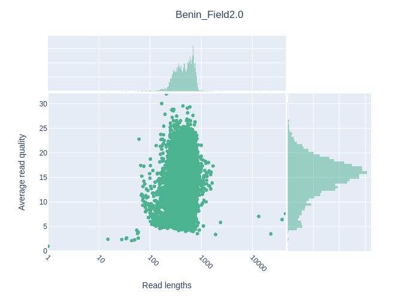

## Intro
At UGent Botanic Garden we organized a field sequencing experiment. The setup was to mimick field conditions i.e. sampling fungi, DNA extraction and PCR on the bentolab followed by live sequencing and basecalling on the mk1B from Oxford nanopore.  
Below you'll find an outline of the data analysis part of this setup including downloadlinks to the data icluding runcommands, so you can rerun the analysis and practice at your own pace.  

## The data  
The original data file consists of reads for 27 accessions collected from the area around Campus Sterra at UGhent.  
All the QC examples below are taken from this data set. If you want to test the workflow I have provided a toy data set with reads for 3 accessions.  
You can download the toy-data here:
```shell
wget https://github.com/passelma42/Field-Sequencing/blob/main/toy-data.tar.gz
```  

!!! NOTES  
	The example is ~20MB and contains reads for 2 samples: Barcode41 and Barcode63.  
	Analysis time was 30 minutes on i7 Intel, 8 core, 16Gb Ram computer.

## The Sequencing Run  
**Method**: [Rapid Barcoding SQK-RBK114.96](https://store.nanoporetech.com/eu/rapid-barcoding-sequencing-kit-96-v14.html)    
**Data Analysis**: [wf-amplicon EPI2ME](https://github.com/epi2me-labs/wf-amplicon)  

!!! NOTES		
	The data and output described below was generated on the full data set. Because this is too large, I cannot share it on this platform. When you run the toy-data though you'll get for the analyzed barcodes the same output as you'll find them in the below plots.  
	
	
We chose the RBK114 kit because this kit is best applicable in the field if you don't have access to a freezer or fridge.
The 'Field sequencing kit' from nanopore is legacy at this point (2024) and was replaced by the Rapid Sequencing kits.  
In this [post](https://community.nanoporetech.com/posts/field-sequencing-kit-repla) you can find results of a stability experiment of the kit kept at ambient temperature.

**The sequencing data folder**  
  
	20240506_1258_MN35631_ASX408_61292243/
			├── barcode_alignment_ASX408_61292243_dc2466ae.tsv
			├── fastq_fail
			├── fastq_pass
			├── fastq_pass.tar.gz
			├── final_summary_ASX408_61292243_dc2466ae.txt
			├── other_reports
			├── pod5_fail
			├── pod5_pass
			├── pore_activity_ASX408_61292243_dc2466ae.csv
			├── report_ASX408_20240506_1302_61292243.json
			├── report_ASX408_20240506_1302_61292243.md
			├── sample_sheet_ASX408_20240506_1302_61292243.csv
			├── sequencing_summary_ASX408_61292243_dc2466ae.txt
			└── throughput_ASX408_61292243_dc2466ae.csv  
**Fastq_pass**  
This folder is where you'll find your sequence reads. Basecalling at SUP means that all reads in this folder are q10 or higher.  
 
```shell
20240506_1258_MN35631_ASX408_61292243/fastq_pass/
			├── barcode41
			│   ├── ASX408_pass_barcode41_61292243_dc2466ae_0.fastq.gz
			│   ├── ASX408_pass_barcode41_61292243_dc2466ae_1.fastq.gz
			│   ├── ASX408_pass_barcode41_61292243_dc2466ae_10.fastq.gz
			│   ├── ASX408_pass_barcode41_61292243_dc2466ae_11.fastq.gz
			│   ├── ASX408_pass_barcode41_61292243_dc2466ae_12.fastq.gz
			│   ├── ASX408_pass_barcode41_61292243_dc2466ae_13.fastq.gz
			├── barcode42
			│   ├── ASX408_pass_barcode42_61292243_dc2466ae_0.fastq.gz
			│   ├── ASX408_pass_barcode42_61292243_dc2466ae_1.fastq.gz
			│   ├── ASX408_pass_barcode42_61292243_dc2466ae_10.fastq.gz
			│   ├── ASX408_pass_barcode42_61292243_dc2466ae_11.fastq.gz
```

### QC sequence run   
Validating your sequencerun requires you to look at a lot of data. Max throughput of a minion flowcell is 50Gbases! Not hard to imagine that doing this manually is not the way to go. For this job we need dedicated sotware!  
There are different tools for visualizing HTS data. Nanopack is such a tool, opzimized for longread data. For validating the sequence run we can use the **sequencing_summary_ASX408_61292243_dc2466ae.txt** file which is generated by Minknow.  

### Tools and Commands    
Tool: [Nanopack](https://github.com/wdecoster/nanopack)  
```shell title="Nanoplot Command"
NanoPlot --summary sequencing_summary_ASX408_61292243_dc2466ae.txt -o summary-plots
```  
**Output**  

NanoPlot gives you a set of *.png plots*, *.txt statistics* and also a handy interactive *Report.html* file.  
We'll take a closer look at some of the output to get grips on what we have sequenced.  

| Metric                           | Value               |
|----------------------------------|---------------------|
| Active channels                  | 88.0                |
| Mean read length                 | 527.2               |
| Mean read quality                | 12.2                |
| Median read length               | 478.0               |
| Median read quality              | 15.3                |
| Number of reads                  | 499,919.0           |
| Read length N50                  | 594.0               |
| STDEV read length                | 2,745.3             |
| Total bases                      | 263,532,800.0       |
| >Q5                              | 492,143 (98.4%), 252.2Mb |
| >Q7                              | 472,784 (94.6%), 238.4Mb |
| >Q10                             | 434,979 (87.0%), 218.4Mb |
| >Q12                             | 392,967 (78.6%), 198.9Mb |
| >Q15                             | 266,363 (53.3%), 137.8Mb |
  
**Number of reads over time**  


**Active pores over time**    


**Quality VS sequencing speed**    
  

**Time vs Speed**  
  

**Quality VS length log scaled (min 200bp - max 1000bp)**   
  

**Summary**  
From these plots and stats we can confirm that we have nearly 500.000 reads with 87% of the reads Q10 and higher. Be aware that the RB114 kit performs tagmentation to add barcodes and adapers hence the 'low' mean read length. FYI our amplicons designed with ITS1f-ITS are about 900bp of length.  
 

## The Data Analysis  
### QC data  
In the previous chapter we performed a QC on the sequencerun to validate the success of failure of the minion sequencerun. Now it is time to have a deeper look because we want to know how well our samples have performed.  
For this experiment we did ITS pcr on 27 samples collected at campus Sterre at UGhent. These samples have been assigned a barcode during the libraryprep and multiplexed into 1 single library to be sequenced.  
This means the data has to be demultiplexed, each unique Barcode sequence is retreived bioinformatically and assigned to a designated barcode folder (see topology above). Equimolar pooling of our barcodes during the libraryprep allows for an equal amount of reads per barcode.  
At least in theory. In real life, 'Numbers tell the table', we are going to measure this. We will again use the nanopack tool but now instead of the NanoPlot command we'll use the NanoComp command. In this way all the barcode stats will lign up in a nice overview. We will also need to prep the data a little bit and run this command in a 'for loop' script. We don't want to tire ourselves too much.  
If this doesn't ring a bell, don't care too much, just follow the instructions below.

**Tool**: [Nanopack](https://github.com/wdecoster/nanopack)  
**Script**: [NanoComp-allfastq.sh](https://raw.githubusercontent.com/passelma42/scrippets/main/nanocomp-allfastq.sh)  

1. Download the script.  
The script will loop over your barcode folders containing the demultiplexed fastq files.  
```shell title="Download and test the script"
$ wget https://raw.githubusercontent.com/passelma42/scrippets/main/nanocomp-allfastq.sh
$ chmod u+x nanocomp-allfastq.sh		# Set run permissions for the user
$ ./nanocomp-allfastq.sh -h 			# Display help function
```  
2. Run NanoComp over your samples
The script will concatenate all fastq files per barcode folder and run nanocomp. After the analysis has finished you'll find a .nanocompout/ folder inside the input folder you issued in the command below (under the *-d* flag).
```shell title="Command"
./nanocomp-allfastq.sh -d ./fastq_pass/ -c
```
```shell title="Output"
(nanopack) passelma@grover:~/Analyses/wf-amplicon/ONT-field2-greenhouse/benin-field2-greenhouse-run/testrunQC/fastq_pass/.nanocompout$ tree
.
├── NanoComp-report.html
├── NanoComp_20240823_1521.log
├── NanoComp_N50.html
├── NanoComp_N50.png
├── NanoComp_OverlayHistogram.html
├── NanoComp_OverlayHistogram.png
├── NanoComp_OverlayHistogram_Normalized.html
├── NanoComp_OverlayHistogram_Normalized.png
├── NanoComp_OverlayHistogram_Weighted.html
├── NanoComp_OverlayHistogram_Weighted.png
├── NanoComp_OverlayLogHistogram.html
├── NanoComp_OverlayLogHistogram.png
├── NanoComp_OverlayLogHistogram_Normalized.html
├── NanoComp_OverlayLogHistogram_Normalized.png
├── NanoComp_OverlayLogHistogram_Weighted.html
├── NanoComp_OverlayLogHistogram_Weighted.png
├── NanoComp_lengths_violin.html
├── NanoComp_lengths_violin.png
├── NanoComp_log_length_violin.html
├── NanoComp_log_length_violin.png
├── NanoComp_number_of_reads.html
├── NanoComp_number_of_reads.png
├── NanoComp_quals_violin.html
├── NanoComp_quals_violin.png
├── NanoComp_total_throughput.html
├── NanoComp_total_throughput.png
└── NanoStats.txt
```
**NanoComp Number of reads per barcode**  
Amongst other plots and reports we will have a look at number of reads per barcode.  
Although all samples have been equimolary pooled, we can already see that BC063 is underrepresented. If only this won't give us coverage issues in downstream applications :-o ??  
Take a closer look at the file *NanoComp-report.html* for more details on other stats.
  
**NanoComp_quals_violin**  
In this violin plot we can confirm all our reads per barcode are of good quality. All the reads are Q10 and above.  
Except again BC63 is acting up... .  


### Build a consensus  
Now that we verified that we have sufficient reads per barcode and they are of good quality, it is time to start with our downstream analysis. It is time to get to buisiness!  
Off course there are many workflows to have a go at this type of data, but in this tutorial we will be showcasing the EPI2ME tool called *wf-amplicon.*.  
All necessary info on how to setup the necessary software and tools to run this workflow can be found on the 'installation' page of this website. In this section we will walk you through the process on how use the tool to build your consensus sequences from your raw nanopore reads.  

Tool: [wf-amplicon](https://github.com/epi2me-labs/wf-amplicon)  

This workflow performs the analysis of reads generated from PCR amplicons. After some pre-processing, reads are either aligned to a reference (containing the expected sequence for each amplicon) for variant calling or the amplicon’s consensus sequence is generated *de novo*.  
Running the tool in 'variant' mode it is possible to run more than one target (in this case genespecific amplicon) for the same species.  
But for this tutorial we will run in the *de novo* mode.  

Installation guides for wf-amplicon can be found here: [wf-amplicon Installation guide](https://labs.epi2me.io/workflows/wf-amplicon/).  

**Run the workflow**  
The workflow can handle different folder layouts. If you followed the above sections of this tutorial, we are working with structure (iii).   
```shell title="data layout"
(i)                     (ii)                 (iii)
input_reads.fastq   ─── input_directory  ─── input_directory
                        ├── reads0.fastq     ├── barcode01
                        └── reads1.fastq     │   ├── reads0.fastq
                                             │   └── reads1.fastq
                                             ├── barcode02
                                             │   ├── reads0.fastq
                                             │   ├── reads1.fastq
                                             │   └── reads2.fastq
                                             └── barcode03
                                              └── reads0.fastq
```  

1. Prepare a sample sheet  
This is a comma delimited file with 3 (or 4 if you run in variant mode) sections.  
The sample sheet is a CSV file with, minimally, columns named *barcode* and *alias*. Extra columns are allowed. In variant calling mode, a ref column can be added to tell the workflow which reference sequences should be used for which sample
```shell title="Example: sample-sheet.csv"
barcode,alias,type,ref
barcode01,BC01,test_sample,ref1
barcode02,BC02,test_sample
barcode03,BC03,test_sample,ref2
```  

2. Prepare reference file when running *variant mode*  
When using a reference file called *reference.fa* it need to look like this. Each ref sequence would the represent a genespecific consensus sequence.  This reference will then be used to *fish* for sequences in your reads to *catch* and *separate* per gene.  
For instance if you amplified ITS and rpb2, mix them per sample and used this as a template to build your library, this tool could give you 2 consensus sequences per species: one ITS consensus and one rpb2 consensus.
```shell title="Example: reference.fa"
>ref1
ATGC
>ref2
CGTA
```
3. Run the wf-amplicon on your samples  
The command below will run a singularity container in a nextflow run. The container beeing *epi2me-labs/wf-amplicon* and the command flags issued by the nextflow tool.  
Rember you have some prepping to do to get your system up and running to be able to run EPI2ME workflows. But believe me, this way is more easier than installing the tools yourself and writing designated scripts to stitch together all data input and oututs to feed into the next program.
```shell title="Command to run"
nextflow run epi2me-labs/wf-amplicon \
    --fastq ./fastq \
    --reference ./reference.fa \
    --sample_sheet ./sample-sheet.csv
    -c /home/sequencing/nextflow-config/nextflow.config \
    -profile singulairy
```  

		--fastq: Path to Input folder which holds fastq files or barcode directories  
		--reference: Including this line invoces running in variant mode, delete if you want to run in de novo mode  
		--sample_sheet: Path to sample sheet file  
		-c: path to config file, see 'Installation' section of this website  
		-profile: We are running the container under the singularity flag, not docker because docker doesn't play nice with HPC
!!! NOTES
	When not running variant mode a reference file is not necessary. Make sure to delete the ref column in the sample sheet and leave out the *--reference flag* from the command in that case.  
	
### Get your data out of here  
Once the workflow has finished, the output can be found in a folder called *output-wf-apmlicon*.  
```shell title="Folder layout"
.
├── output-wf-amplicon
│   ├── barcode41
│   │   ├── alignments
│   │   │   ├── aligned.sorted.bam
│   │   │   └── aligned.sorted.bam.bai
│   │   └── consensus
│   │       └── consensus.fastq
│   ├── barcode42
│   │   ├── alignments
│   │   │   ├── aligned.sorted.bam
│   │   │   └── aligned.sorted.bam.bai
│   │   └── consensus
│   │       └── consensus.fastq
```  
Offcourse it would be too much to ask if the consensus sequence is given to us in a nice way i.e. having a sensible discriptive name like *barcode41.consensus.fastq*. Or something similar. "Alas poor Yorick". We'll have to fidle ourselves.  
**Script**: [rename-consensus.sh](https://github.com/passelma42/scrippets/blob/main/rename-consensus.sh)  
This script will digg into each individual barcode folder and rename the *consensus.fastq* file accordingly and finally copy it to *output-wf-ampmicon* folder. Isn't that neat!  

1. Download the script and set runpermissions  
```shell
wget https://raw.githubusercontent.com/passelma42/scrippets/main/rename-consensus.sh
chmod u+x rename-consensus.sh		# Set run permissions for the user
```
2. Execute the script
```shell
./rename-consensus.sh
```
!!! WARNING
	Verify you run the script from the *output-wf-amplicon* folder  

```shell title="Layout folder after rename script"
/output-wf-amlicon-nosubsample$ tree -L 1
	.
	├── barcode41
	├── barcode41.consensus.fastq
	├── barcode42
	├── barcode42.consensus.fastq
```  
This final output gives you one consensus fastq per barcode which now you can use for blast or other alignment tools, phylogenetics,... .  