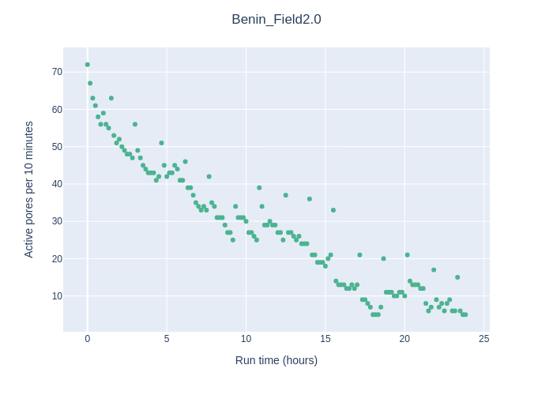
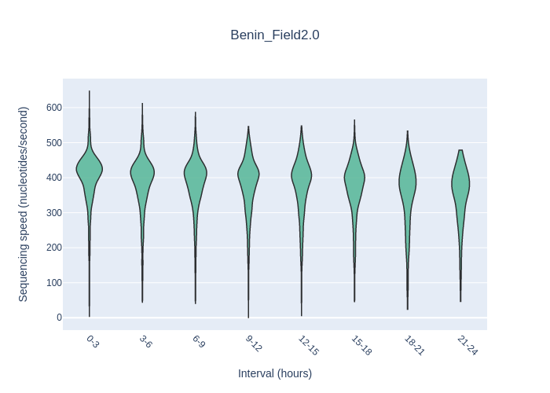

## Sequencing & Basecalling  
Method: [Rapid Barcoding SQK-RBK114.96](https://store.nanoporetech.com/eu/rapid-barcoding-sequencing-kit-96-v14.html)  
Dorado model: dna_r10.4.1_e8.2_260bps_sup@v4.1.0
## QC Data  
### Commands  
Tool: [Nanopack](https://github.com/wdecoster/nanopack)  
```shell title="Nanoplot Command"
NanoPlot --summary sequencing_summary.txt -o summary-plots
```  
### Output  

| Metric                           | Value               |
|----------------------------------|---------------------|
| Active channels                  | 88.0                |
| Mean read length                 | 527.2               |
| Mean read quality                | 12.2                |
| Median read length               | 478.0               |
| Median read quality              | 15.3                |
| Number of reads                  | 499,919.0           |
| Read length N50                  | 594.0               |
| STDEV read length                | 2,745.3             |
| Total bases                      | 263,532,800.0       |
| >Q5                              | 492,143 (98.4%), 252.2Mb |
| >Q7                              | 472,784 (94.6%), 238.4Mb |
| >Q10                             | 434,979 (87.0%), 218.4Mb |
| >Q12                             | 392,967 (78.6%), 198.9Mb |
| >Q15                             | 266,363 (53.3%), 137.8Mb |

#### Number of reads VS active pores  
Number of reads over time  


Active pores over time  


#### Quality VS sequencing speed  
Time vs Quality  
  

Time vs Speed  
  

#### Quality VS length  
Quality VS length (min 200bp - max 1000bp)  
  

## Data Processing: Create Consensus  
### wf-amplicon  
Tool: [wf-amplicon](https://github.com/epi2me-labs/wf-amplicon)  

This workflow performs the analysis of reads generated from PCR amplicons. After some pre-processing, reads are either aligned to a reference (containing the expected sequence for each amplicon) for variant calling or the amplicon’s consensus sequence is generated *de novo*.  

Installation guides for wf-amplicon can be found here: [wf-amplicon Installation guide](https://labs.epi2me.io/workflows/wf-amplicon/).  

### Run the workflow  
```shell title="data layout"
(i)                     (ii)                 (iii)
input_reads.fastq   ─── input_directory  ─── input_directory
                        ├── reads0.fastq     ├── barcode01
                        └── reads1.fastq     │   ├── reads0.fastq
                                             │   └── reads1.fastq
                                             ├── barcode02
                                             │   ├── reads0.fastq
                                             │   ├── reads1.fastq
                                             │   └── reads2.fastq
                                             └── barcode03
                                              └── reads0.fastq
```
```shell title="Command to run"
nextflow run epi2me-labs/wf-amplicon \
    --fastq ./fastq \
    --reference ./reference.fa \
    --sample_sheet ./sample-sheet.csv
    -c /home/sequencing/nextflow-config/nextflow.config \
    -profile singulairy
```
```shell title="Example: sample-sheet.csv"
barcode,alias,type,ref
barcode41,BC41,test_sample,ref1
barcode42,BC42,test_sample
barcode43,BC43,test_sample,ref2
```
```shell title="Example: reference.fa"
>ref1
ATGC
>ref2
CGTA
```
!!! NOTES
	When not running variant mode a reference file is not necessary. Also make sure to delete the ref column in that case. 
## Data validation: Barcoding - Blast  
