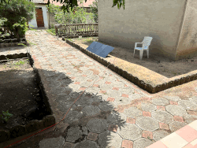
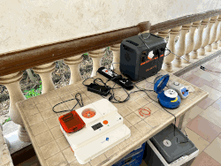

# Building a GPU-Enabled Field Sequencing Workstation

Modern nanopore sequencing workflows rely heavily on GPU acceleration for basecalling, demultiplexing, and downstream data analysis. A properly configured workstation enables real-time processing of sequencing data during field deployments and significantly reduces analysis times compared to CPU-only systems.

This guide describes how to build and configure a portable Linux workstation suitable for Oxford Nanopore sequencing and bioinformatics analyses. For more detailed information on installation and usage I refer to the official documentation or another chapters of this repo.

---
## Chapter 1: Hardware Recommendations

### 1.1 Minimum Configuration
!!! info "IT requirements latest recommendations Nanopore"
	[https://nanoporetech.com/communitylab-it-requirements](https://nanoporetech.com/communitylab-it-requirements)  

Suitable for training, demonstrations, and small sequencing runs.

- Quad-core CPU
- 16 GB RAM
- NVIDIA RTX 4060 (8 GB VRAM)
- 1 TB NVMe SSD
- Ubuntu Linux

### 1.2 Recommended Configuration

Suitable for routine field sequencing and bioinformatics.

- AMD Ryzen 7 / Intel i7 or better
- 32 GB RAM
- NVIDIA RTX 4070 or RTX 4080
- 2 TB NVMe SSD
- Ubuntu Linux
- External backup SSD

### 1.3 High-Performance Configuration

Suitable for metagenomics, genome assembly, and intensive workflows.

- AMD Ryzen 9 / Intel i9
- 64 GB RAM
- RTX 4090 or similar
- 4 TB NVMe SSD
- Multiple external backup drives

---

## Chapter 2: Operating System

### 2.1 Ubuntu Linux

**Recommended:** Ubuntu 24.04 LTS

**Supported:** Ubuntu 22.04 LTS

Ubuntu remains one of the most widely supported operating systems for bioinformatics software, NVIDIA drivers, and Oxford Nanopore analysis tools.

**Ubuntu installation instructions:**

<https://ubuntu.com/tutorials/install-ubuntu-desktop>

---

## Chapter 3: GPU  

Why a GPU Matters?

Modern nanopore analysis workflows are strongly accelerated by NVIDIA GPUs.

GPU acceleration is used for:

- Dorado basecalling
- Duplex basecalling
- Modified-base detection
- Deep-learning models
- Real-time field analysis

Real-time basecalling during sequencing is generally only practical using a dedicated GPU.

---

## Chapter 4: Minknow  

MinKNOW controls all Oxford Nanopore sequencing devices, performing several core tasks, including data acquisition, real-time analysis, basecalling, and data streaming.

[link to MinKNOW installation guide](https://nanoporetech.com/document/experiment-companion-minknow)


!!! Warning
        MinKNOW might give you problems when installing or when updates are beeing made.  
        For Minknow trouble shooting see Section:  
                "System Documentaion/Minknow-troubleshooting"  
        of this webpage.

---  
## Chapter 5: Dorado Basecalling

### 5.1 What is Dorado?

Dorado is the current Oxford Nanopore production basecaller. Dorado client is part of MinKNOW but you can use the software post-sequencing to rebasecall and ohter things.

Capabilities include:

- GPU acceleration
- Duplex basecalling
- Modified-base detection
- Integrated demultiplexing
- POD5 support

Always download the latest release from:

<https://github.com/nanoporetech/dorado>  
<https://nanoporetech.com/software>

---

### 5.2 Dorado Performance Expectations

Approximate simplex basecalling performance:

| GPU | Typical Performance |
|------|------|
| RTX 4060 | Suitable for training and smaller projects |
| RTX 4070 | Excellent field sequencing performance |
| RTX 4080 | Excellent real-time sequenc*ng performance |
| RTX 4090 | Ideal for intensive bioinfo*matics workflows |

Actual performance depends on flowcell type, sequencing chemistry, modelselection, and available GPU resources.  

For a broader performance overview checkout this comparison:  
<https://github.com/Kirk3gaard/2025-Crowdsource-GPU-basecalling-stats>  

---

## Chapter 6: Storage Recommendations

Nanopore datasets can rapidly become large.

### 6.1 Minimum

- 1 TB NVMe SSD

### 6.2 Recommended

- 2 TB NVMe SSD
- 4 TB external SSD backup

!!! warning
        Avoid keeping the only copy of your sequencing data on a single device.

---

## Chapter 7: Memory (RAM)

Recommended system memory:  

| Application | RAM |
|------------|------|
| Basecalling | 16 GB |
| Routine analysis | 32 GB |
| Metagenomics | 64 GB |
| Large assemblies | 64-128 GB |  

----
## Chapter 8: Installing BioInfo tools

Installing Bioinformatic software can be a difficult feat in a linux environment. Below, we give a few examples to help you do this. Github repositories usually give you a good clue on how to get an installation going. Important is that you maintain a stable and reproducible environment where you run your analyses. Knowing Bioinformaticians can release new versions of their tools every few moments, this can be a problem. Below and in other sections of this website we will discuss tools and packagemanagers to help you in this regard.  

### 8.1 Container Technologies

Modern bioinformatics increasingly relies on containers. You can look at containers as a closed off, portable system where you have your software installed and together with your sequence data you can run Analyses in a reproducible way (i.e. if you are still using softwarepackage 1.0 but the latert downloadable version is 1.5 you still can run the old one).  

#### 8.2 Docker

Useful for local workstation deployment.  
Go To: [Docker Documentation](https://www.docker.com/)  

#### 8.3 Apptainer

Preferred on many HPC systems and research infrastructures.  
Go To: [Apptainer Documentation](https://apptainer.org/).  

Advantages in using containers:

- Reproducibility
- Portable software environments
- Easier software deployment
- HPC compatibil*ty

---

### 8.4 Python Environments (pyenv)  

pyenv is usually worth using because it allows you to maintain older pipeline-compatible Python versions while still using the latest Python releases for new development, without touching the system Python. A very common setup is:
Avoid installing bioinformatics software directly into the operating system (which is also Python based). 
Instead create dedidcated python environments to run pythonbased tools. This will help you to keep a clean and functional system.  

See Pyenv extended documentation: [https://github.com/pyenv/pyenv](https://github.com/pyenv/pyenv).  

This works well when:

- You only need Python packages
- Everything installs cleanly from PyPI
- You don't need non-Python bioinformatics tools

---

### 8.5 Package managers  
#### 8.5.1 Conda  

Conda remains a popular package management system in bioinformatics.

Install Miniforge:

<https://conda-forge.org/miniforge/>

Create a new environments and install using the appropriate ```conda install``` commands.
An overview of available software to be installed through conda can be found here: [https://bioconda.github.io/conda-package_index.html](https://bioconda.github.io/conda-package_index.html). 

#### 8.5.2 Pixi  

Pixi manages different tools (nanopack, python, flye, samtools,...) all from a single project definition. It also generates a lock file for reproducibility. Pixi builds upon the foundation of the conda ecosystem, introducing a workspace-centric approach rather than focusing solely on environments. This shift towards workspaces offers a more organized and efficient way to manage dependencies and run code, tailored to modern development practices. It uses the same software index as ```conda forge```. So if you find it there it can be installed using pixi.   

For more information Read the docs here: [https://pixi.prefix.dev/latest/](https://pixi.prefix.dev/latest/)

---

## Chapter 9: Mobile lab equipment

### 9.1 Bento Lab

[Bento Lab](https://bento.bio/) is a portable molecular biology workstation that combines a:

- PCR thermocycler
- Microcentrifuge
- Gel electrophoresis system
- Blue-light transilluminator

into a single compact device suitable for laboratory and field-based molecular biology workflows. It can be used for DNA extraction, PCR amplification, gel electrophoresis, DNA barcoding, eDNA studies, and nanopore sequencing workflows.  
For protocols, tutorials, user manuals, and field deployment examples, consult the Bento lab Knowledge Hub:  
<https://bento.bio/resources/>

---

### 9.2 Power Requirements

BentoLab reports a maximum power consumption of approximately: 140W

Therefore, any battery solution should provide:

- AC power output (110–240 V)
- Minimum continuous output of 140 W

A larger battery capacity is recommended for extended field deployments.

---

### 9.3 Batteries and Solar Panels

For short field trips, a portable power station of approximately 150Wh may be sufficient for PCR-based workflows. For multi-day deployments, larger battery systems are recommended. Bento Bio has demonstrated the use of larger portable power stations that can be recharged using solar panels or vehicle power sources.

Recommended setup:

```text
100–200 W Foldable Solar Panel
            ↓
Portable Power Station
            ↓
Bento Lab + Laptop + MinION
```

This configuration enables extended off-grid operation for biodiversity monitoring, DNA barcoding, and eDNA projects.  

!!! info "Example of our Power Setup in the field"

    
     

    **Solar panel:** BLUETTI MP200 (200W)  
    **Portable power station:** BLUETTI AC180P (1.800W, 1.440Wh)  
    **BentoLab:** for all necessary labwork (DNA extraction, PCR, NanoPore libprep and sequencing)

## Chapter 10: Pre-Deployment Checklist

Before leaving for the field:

- [x] NVIDIA driver installed
- [x] CUDA verified
- [x] Dorado tested
- [x] Required software installed
- [x] SSD space checked
- [x] Backup SSD available
- [x] Power adapters packed
- [x] Flow cells checked
- [x] Basecalling test completed
- [x] Internet-independent workflows verifiedÒ

!!! warning
	MinKnow software needs an internet connection to be able to funcion. When operating in the field without internet connection, contact Nanopore to accomodate you and help you to setup an off-line version of MinKnow on your portable computer.  
